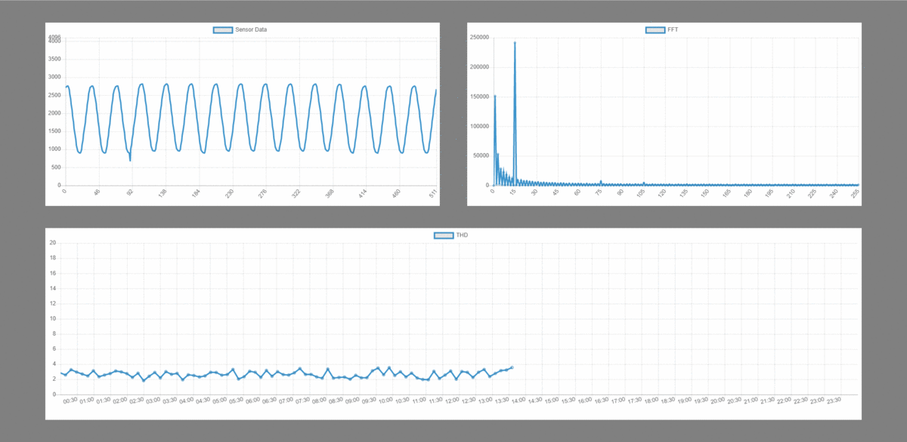

# Mains Voltage Remote Monitoring




## Getting Started

These instructions will get you a copy of the project up and running on your local machine for development and testing purposes. See deployment for notes on how to deploy the project on a live system.

### Prerequisites

* Knowledge on how to program ESP32 devices with Arduino IDE.
* [Dependencies](#built-with) are listed at the bottom of the page.


### Installing

#### Creating a Firebase Realtime Database

Follow https://medium.com/@vibrologic/serverless-iots-with-firebase-realtime-database-and-esp32-2d86eda06ff1 to see a step by step guide with images that are similar to the ones described in this section.

1. Create a new Firebase Project.
2. Create a new Realtime Databse.
3. Set the Database Rules to true (**warning** anyone can alter the database).
4. Get the Database host name and secret.
5. Update [firmware](firmware/firmware.ino) with your WiFi and Realtime Database credentials (obtained in the previous step).

```
#define WIFI_SSID           "XXX"                 // owner's network ssid
#define WIFI_PASSWORD       "XXX"                 // owner's network password
#define FIREBASE_HOST       "XXX"                 // firebase's project site
#define FIREBASE_AUTH       "XXX"                 // secret (40 chars) (deprecated...)
```

#### Setting up Firebase Hosting

1. Open **Project Settings** by clicking on the Cog Icon next to **Project Overview** and then selecting the first option. Under the **General** tab, look for **Your Apps** and click the **</>** symbol to add a new web application. Choose an App Nickname and check the box below to set up **Firebase Hosting**. Follow the instructions and then click on the last button to go back to the configuration screen.
2. Click the **Config** radio button under **Firebase SDK snippet** to get the firebase configuration script.
3. Update [myapp](firebase/public/myapp.js) with the information obtained in the previous step.
```
const firebaseConfig = {
	apiKey: 			"XXX",
	authDomain: 			"XXX",
	databaseURL: 			"XXX",
	projectId: 			"XXX",
	storageBucket: 			"XXX",
	messagingSenderId: 		"XXX",
	appId: 				"XXX"
};
```
4. Update [firebaserc](firebase/.firebaserc) with your Firebase Project ID. You can find this information under the **General** tab on **Project Settings**.
```
{
  "projects": {
    "default": "XXX"
  }
}
```

#### Deploying Web App with CLI (windows)
1. Open firebase-cli.exe and navegate to this project's firebase folder using the `cd` command.
2. Initialize a Firebase project with `firebase init`.
3. Proceed with the initialization and then select **Cloud Functions** and **Hosting** features. CLI will find an existing project in this folder and then ask to configure **functions** and then **hosting** files. 
4. **Functions**. Select **TypeScript** as the language used in **Cloud Functions** and choose to use TSLint. Do not overwrite any files asked in this configuration.
   - CLI may ask to install npm dependencies afterwards. It is wise to accept this procedure. 
5. **Hosting**. Press enter to select **public** as the web app main folder and accept to rewrite all urls to index. Do not overwrite any files asked in this configuration.
6. Deploy the web app project with `firebase deploy`. This step will take some time, and in the end CLI will return the URL for the web app, such as **Hosting URL: https://esp32-mains-voltage-monitor.firebaseapp.com**.


#### Hardware Configuration

1. Upload the code to ESP32 board ([DOIT Esp32 DevKit v1](https://docs.zerynth.com/latest/official/board.zerynth.doit_esp32/docs/index.html)).
2. Connect the VP pin to any analog voltage source ranging from 0 to 3.3 to acquire data that will be displayed in the Firebase web app. In this project, the analog source is provided by the mains voltage sensor described by the schematic below.


(IMAGE)

<!-- End with an example of getting some data out of the system or using it for a little demo -->

<!--

## Running the tests

Explain how to run the automated tests for this system

### Break down into end to end tests

Explain what these tests test and why

```
Give an example
```

### And coding style tests

Explain what these tests test and why

```
Give an example
```

## Deployment

Add additional notes about how to deploy this on a live system

-->

## Built With

* [DOIT Esp32 DevKit v1](https://docs.zerynth.com/latest/official/board.zerynth.doit_esp32/docs/index.html) - ESP32 board used
* [ESP32 with Arduino IDE](https://github.com/espressif/arduino-esp32) - Arduino core for the ESP32
* [FirebaseESP32](https://github.com/mobizt/Firebase-ESP32) - Firebase Arduino Library for ESP32
* [arduinoFFT](https://github.com/kosme/arduinoFFT) - Arduino FFT Library
* [Chartjs](https://www.chartjs.org/) - Used to generate the graphs


## Authors

* **Fernando Venceslau Isensee** - *Initial work* - [fervenceslau](https://github.com/fervenceslau/)

## License

<!--- This project is licensed under the MIT License - see the [LICENSE.md](LICENSE.md) file for details --->
