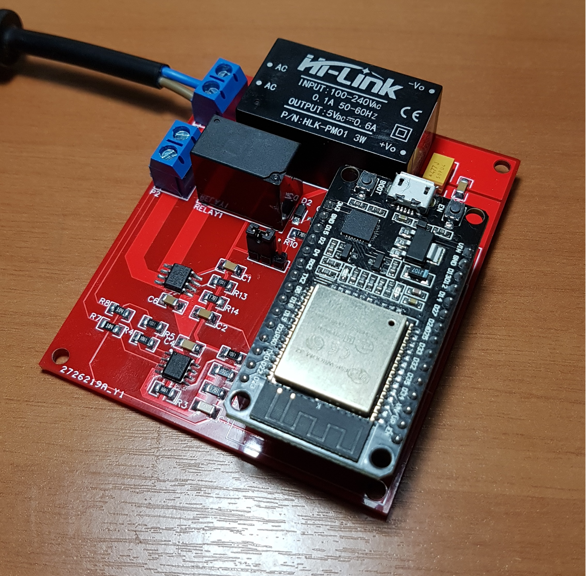

<!------>
# Mains Remote Wattmeter with ESP32 and Firebase

  

## Authors

* **Fernando Venceslau Isensee** - *Initial work* - [fervenceslau](https://github.com/fervenceslau/)

## License

This project is licensed under the GNU General Public License, version 3 (GPLv3) - see the [LICENSE](LICENSE) file for details